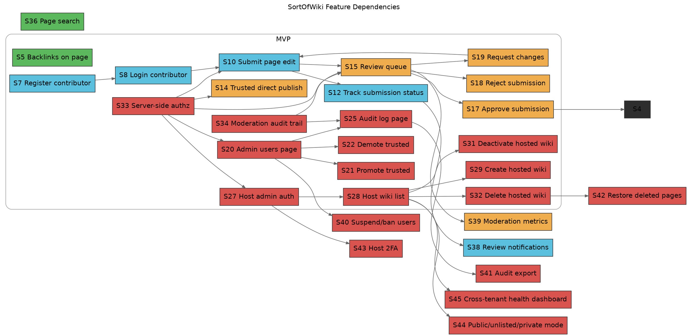

# SortOfWiki Product User Stories

## 1) Opinionated URL Map

- `/` - public homepage with hosted wiki catalog
- `/w/:wikiSlug` - wiki homepage (latest activity, key navigation)
- `/w/:wikiSlug/pages` - page index
- `/w/:wikiSlug/p/:pageSlug` - published page view
- `/w/:wikiSlug/register` - register as wiki contributor
- `/w/:wikiSlug/login` - login
- `/w/:wikiSlug/submit/new` - submit a new page draft for review (story 9)
- `/w/:wikiSlug/submit/edit/:pageSlug` - propose an edit to a published page (story 10)
- `/w/:wikiSlug/submit/delete/:pageSlug` - request deletion of a published page (story 11)
- `/w/:wikiSlug/submit/:submissionId` - contributor submission detail
- `/w/:wikiSlug/review` - review queue for trusted contributors and admins
- `/w/:wikiSlug/review/:submissionId` - review detail and decision screen
- `/w/:wikiSlug/admin` - wiki admin landing
- `/w/:wikiSlug/admin/users` - role and trust management
- `/w/:wikiSlug/admin/audit` - audit log
- `/w/:wikiSlug/settings/profile` - user profile for this wiki
- `/admin` - hidden platform host-admin entry point
- `/admin/wikis` - host-admin wiki management list
- `/admin/wikis/new` - create new hosted wiki
- `/admin/wikis/:wikiSlug` - hosted wiki metadata and lifecycle controls

## 3) MVP User Stories (Numbered)

1. [x] Viewer can open `/` and see a list of hosted wikis so that they can discover available communities.
2. [x] Viewer can open `/w/:wikiSlug` so that they can access a specific wiki.
3. [x] Viewer can open `/w/:wikiSlug/pages` so that they can browse published pages.
4. [x] Viewer can open `/w/:wikiSlug/p/:pageSlug` so that they can read published content.
5. [x] Viewer can see backlinks on a page so that they can find related pages.
6. [x] Viewer can only see published revisions so that unreviewed changes are not exposed.
7. [x] Contributor can register at `/w/:wikiSlug/register` so that they can submit page changes.
8. [x] Contributor can log in at `/w/:wikiSlug/login` so that their submissions are attributed to them.
9. [x] Contributor can submit a new page draft so that it can be reviewed.
10. [x] Contributor can submit edits to an existing page so that they can improve content.
11. [x] Contributor can request page deletion through a submission so that removals are moderated.
12. [x] Contributor can view submission status so that they know whether a change is pending, approved, rejected, or needs revision. Seeded demo: log in on `demo` as `statusdemo` / `password12` and open `/w/demo/submit/sub_rejected_demo`, `/w/demo/submit/sub_approved_demo`, or `/w/demo/submit/sub_needs_revision_demo` to see non-pending statuses.
13. [x] Contributor can read reviewer notes on rejected or revision-requested submissions so that they can improve and resubmit. Seeded demo: same as story 12 login; rejected submission `sub_rejected_demo` includes a reviewer note; `sub_needs_revision_demo` includes guidance text.
14. [x]  Trusted contributor can publish page create/edit/delete changes immediately so that routine maintenance is fast. Seeded demo: log in on `demo` as `trustedpub` / `password12` to publish directly; standard contributors still go through review.
15. [x]  Trusted contributor can open `/w/:wikiSlug/review` so that they can process pending submissions. Seeded demo: log in on `demo` as `trustedpub` / `password12` and open `/w/demo/review` to see pending submission `sub_queue_demo` from standard user `statusdemo`.
16. [x]  Trusted contributor can inspect submission diffs so that they can make informed moderation decisions.
17. [x]  Trusted contributor can approve a submission so that it goes live.
18. [x]  Trusted contributor can reject a submission with a reason so that harmful or low-quality changes are blocked.
19. [x]  Trusted contributor can request changes with guidance so that contributors can iterate.
20. [x]  Wiki admin can open `/w/:wikiSlug/admin/users` so that they can manage contributor trust levels. Seeded demo: log in on `demo` as `wikidemo` / `password12` and open `/w/demo/admin/users` to see contributors (`statusdemo`, `trustedpub`, `grantadmin_trusted`, `wikidemo`) and roles.
21. [x]  Wiki admin can promote an editor to trusted contributor so that reliable editors can publish directly.
22. [x]  Wiki admin can demote a trusted contributor to contributor so that risky behavior can be contained.
23. [x]  Wiki admin can grant admin rights to another trusted contributor so that governance can be shared. Seeded demo: on `demo`, trusted user `grantadmin_trusted` / `password12` exists to be promoted to admin from `/w/demo/admin/users` (story 23); wiki admin `wikidemo` can use **Make admin** on that row.
24. [x]  Wiki admin can revoke admin rights so that incorrect access can be corrected. Seeded demo: on `demo`, log in as `wikidemo` / `password12`, open `/w/demo/admin/users`, use **Make admin** on `grantadmin_trusted` if they are still trusted, then **Revoke admin** on that row; they become trusted again. Server-side listing uses `WikiContributors.isAdminForWiki` (trusted users do not pass).
25. [x]  Wiki admin can open `/w/:wikiSlug/admin/audit` so that they can see what changed and by whom.
26. [x]  Wiki admin can filter audit events by actor, page, and event type so that they can investigate incidents.
27. [x]  Platform host admin can authenticate at `/admin` using the hidden URL and password so that platform operations remain restricted.
28. [x]  Platform host admin can open `/admin/wikis` and see all hosted wikis so that they can manage the catalog.
29. [x]  Platform host admin can create a hosted wiki so that new communities can be launched.
30. [x]  Platform host admin can edit hosted wiki metadata (name, summary, slug policy) so that discoverability stays accurate.
31. [x]  Platform host admin can deactivate a hosted wiki so that unsafe or inactive tenants can be paused without data loss.
32. [x]  Platform host admin can delete a hosted wiki through explicit confirmation so that irreversible operations are deliberate and auditable.
33. [x]  As any authenticated role, my authorization is checked server-side so that direct URL access cannot bypass permissions.
34. [x]  As an admin or trusted contributor, all moderation decisions are logged with actor and timestamp so that governance is accountable.
35. [x] Viewer can open an unknown URL and see a 404 page so that broken or mistyped links are clearly not valid content.
46. [x] Viewer sees `[[page-slug]]` and `[[page-slug|label]]` in published markdown as links to that page on the current wiki (same `/w/:wikiSlug/p/...` URL space).

## 4) Post-MVP User Stories (Numbered)

36. [ ] Viewer can search pages within a wiki so that they can quickly find relevant pages.
37. [ ] Viewer can sort wiki catalog entries by activity so that they can find active communities.
38. [ ] Contributor can receive in-app notifications for review decisions so that they do not need to poll manually.
39. [ ] Trusted contributor can view moderation workload metrics so that review throughput can be balanced.
40. [ ] Wiki admin can suspend or ban abusive users so that repeated abuse can be controlled quickly.
41. [ ] Wiki admin can export audit logs so that compliance and external review are possible.
42. [ ] Wiki admin can restore deleted pages from a retention window so that mistakes are reversible.
43. [ ] Platform host admin can enforce optional second-factor login so that host controls have stronger protection.
44. [ ] Platform host admin can mark wikis as public, unlisted, or private so that visibility policy is explicit.
45. [ ] Platform host admin can view cross-tenant health dashboards so that operational issues are detected early.

## 5) Graphviz Feature Dependency Graph

